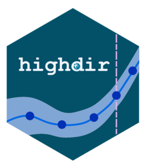

<!-- README.md is generated from README.Rmd. Please edit that file -->

# highdir <a href="https://github.com/folkehelsestats/highdir"></a>

[](https://github.com/folkehelsestats/highdir/actions/workflows/R-CMD-check.yaml)
[](https://app.codecov.io/gh/folkehelsestats/highdir)
[](https://lifecycle.r-lib.org/articles/stages.html#stable)
[](https://CRAN.R-project.org/package=highdir)
[](https://cranlogs.r-pkg.org/badges/grand-total/highdir)

**highdir** is an R package that provides a unified, mode-agnostic API
for building dynamic or static figures with either
[**highcharter**](https://jkunst.com/highcharter/),
[**ggplot2**](https://ggplot2.tidyverse.org/) or other R solutions where
relevant.

The package provides two complementary yet fully interoperable APIs for
creating figures:

1.  **Declarative API** - define all components of a figure up front and
    render it in a single step.
2.  **Layered API** - incrementally compose a figure by adding layers,
    similar to the *grammar of graphics*.

Both APIs produce equivalent visual output and can target any supported
mode without changes to the calling code.

With the **declarative API**, a figure is specified once as an `hd_spec`
object and can later be rendered to different modes. Mode-specific
presentation options (such as interactivity or styling tweaks) can be
supplied separately via an `hc_opts` object prior to rendering.

The **layered API** supports an exploratory, iterative workflow. Figures
are built step by step using `+` similar to **ggplot2** style, making
this approach particularly well suited for interactive analysis and
rapid prototyping, while remaining mode-independent.

By default, **highdir** ships with colour palette, theme, and visual
identity of [The Norwegian Directorate of
Health](https://www.helsedirektoratet.no) (*Helsedirektoratet*). To
further enhance usability, a Shiny graphical user interfacef for
building and previewing figures is also included as part of the package.

------------------------------------------------------------------------

## Installation

``` r
# Install from CRAN 
install.packages("highdir")

# Install development version from GitHub 
if(!require(remotes)) install.packages("remotes")
remotes::install_github("folkehelsestats/highdir")
```

------------------------------------------------------------------------

## Get started

The simplest way to get started with *highdir* is by using the built-in
Shiny app. It shows also codes to demonstrate how to use the package
programmatically in R. Start the app with:

``` r
library(highdir)
hd_app()
```

The app is also available directly through ShinyApps.io at:
<https://ybkamaleri.shinyapps.io/highdir/>

------------------------------------------------------------------------

## Supported geometries

| Name | dynamic mode | static mode | Extra args |
|:---|:---|:---|:---|
| `column` | column | `geom_col()` | — |
| `ranked_bar` | column | `geom_col()` | `vs`, `aim`, `char_scale`, `min_frac` |
| `line` | line / spline | `geom_line()` | `smooth`, `dot_size`, `line_symbols` |
| `scatter` | scatter | `geom_point()` | `dot_size` |
| `arearange` | arearange | `geom_ribbon()` | `ymin`, `ymax` |
| `pie` | pie | `geom_bar()`, `coord_polar()` | `inner_size` |
| `stacked_column` | column | `geom_bar()`, `facet_wrap()` | `stack`, `stacking` |
| `venn` | venn | eulerr::euler() |  |

------------------------------------------------------------------------

To see complete list of extra arguments for specify geoms use
`geom_args()` function:

``` r
geom_args("ranked_bar")
geom_args("arearange")
```

## License

MIT © Kamaleri
